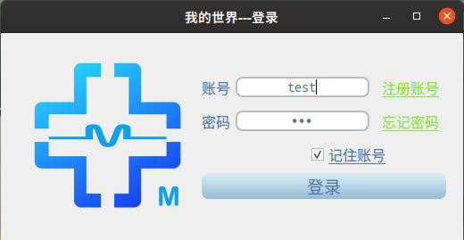
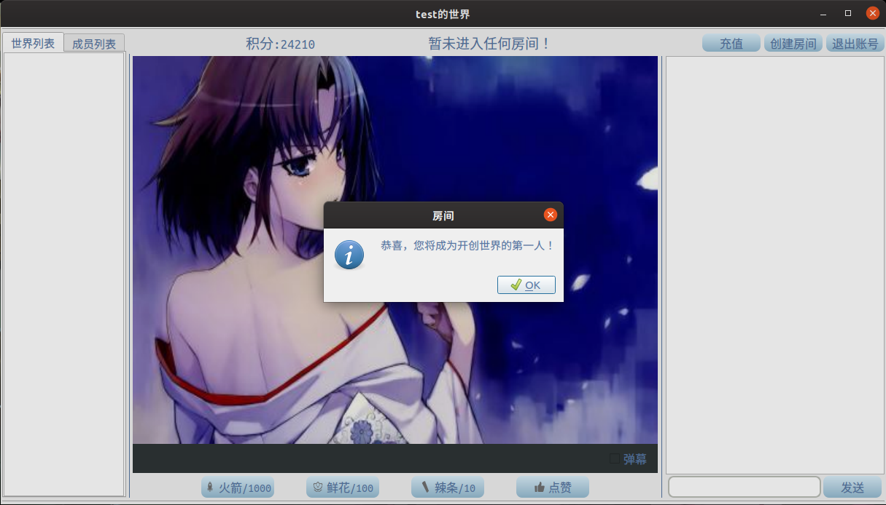
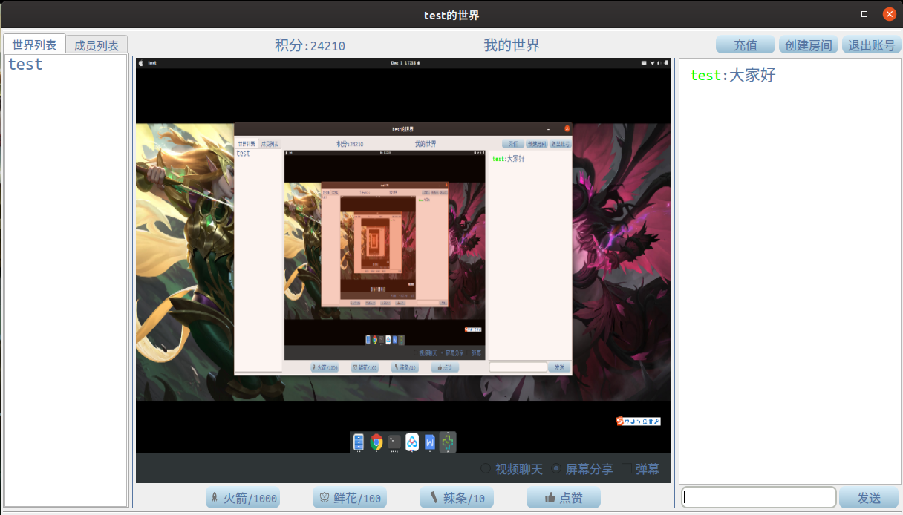

# live-platform-LAN
* It is a live platform in LAN based on Qt graphical framework, with video text chat, screen sharing, live beeps and other functions using MySQL database.

* Related technology: SHA224 encryption technology, data compression technology, Socket data communication technology, STMP mailbox verification.

* Let me show you some window interfaces:

* <h1 align="center">
    
  </h1>

  <h1 align="center">
    
  </h1>

  <h1 align="center">
    
  </h1>

